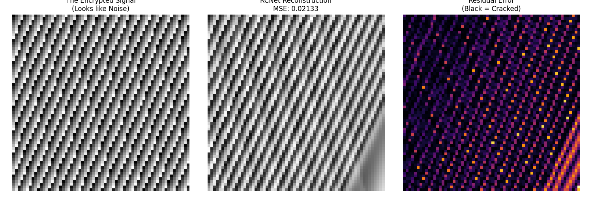

# NoMoreSecrets: Differentiable Lattice Breaker
### Neural Phase Unwrapping for Visual Cryptanalysis

  
*Left: The Encrypted Signal (Visual Noise). Middle: RCNet Reconstruction (Recovered Wave). Right: Residual Error.*

**NoMoreSecrets** is a proof-of-concept for **Differentiable Cryptanalysis** using **Complex-Valued Neural Networks (CVNNs)**.

It demonstrates that **Resonant Cortex Networks (RCNet)** can break *visual ciphers* based on modular arithmetic (lattices) by treating the modulo operator not as a hard discontinuity, but as a continuous **phase wrap**.

---

## 🔐 The Hypothesis

Standard deep learning models (CNNs, Transformers, ReLU MLPs) struggle with modulo-based functions:

\[
y = ax \bmod p
\]

The modulo operator introduces high-frequency discontinuities that appear as random noise in real-valued activation spaces.

### RCNet Hypothesis

In the **complex domain**, modulo is **topology, not noise**:

\[
x \bmod P \cong e^{i \frac{2\pi x}{P}}
\]

A standard network sees a *cliff*.  
RCNet sees a **circle**.

By learning phase continuity instead of value continuity, RCNet can **unwrap lattice-based signals** and recover the hidden linear structure:

\[
y = A x + B y
\]

---

## 🧪 The Experiment

We generate a lattice-noise image using a hidden linear key wrapped by a modulo:

\[
\text{Pixel}(x,y) = (A x + B y) \bmod 255
\]

To humans and standard FFTs, this appears as high-entropy TV static.

We train a **Resonant Cortex Network (CVNN)** to predict pixel values from \((x,y)\) coordinates.

---

  

## 📊 Results

- **10,000 Epochs** – Fundamental frequency detected (directional blur)
- **110,000 Epochs** – **Phase lock achieved**
- **MSE**: `0.045 → 0.022` (and falling)

The network reconstructs the full sawtooth structure of the modulo function and implicitly recovers the hidden key.

**Conclusion:**  
The lattice “noise” is not noise — it is a wrapped analog signal.

---

## 🛠️ Usage

### 1. Install Dependencies

CUDA-enabled PyTorch is recommended for complex operations.

```bash
pip install torch numpy matplotlib seaborn
```

### 2. Run the Breaker

```bash
python crypto_grok.py
```

This will:

- Generate a random secret key
- Encrypt a lattice image
- Train RCNet to recover it in real time

### 3. Visualize

The script periodically saves `crypto_grok.png`:

- **Left**: Ground Truth (Cipher)
- **Middle**: RCNet Reconstruction
- **Right**: Difference Map (black = success)

---

## 🧠 Architecture: Resonant Cortex Network

RCNet is a physics-informed architecture where neurons behave as **coupled oscillators**.

```python
class ResonantColumn(nn.Module):
    def forward(self, z):
        # 1. Interference (Linear Mixing)
        z_mixed = self.mixer(z)
        
        # 2. Resonance (Non-Linearity)
        amp = torch.tanh(torch.abs(z_mixed))   # amplitude saturation
        phase = torch.angle(z_mixed) + self.bias_phase  # phase rotation
        
        return torch.polar(amp, phase)
```

Key properties:

- Complex-valued latent space
- Phase continuity instead of value continuity
- Differentiable phase unwrapping
- Emergent frequency locking

---

## ⚠️ Implications for Cryptography

This work challenges a core intuition behind **lattice-based cryptography** (e.g., LWE, Kyber):

> That modulo noise destroys structure.

For **low-dimensional visual lattices**, the noise is actually *structured phase information*.

RCNet acts as a **differentiable phase solver**, not a brute-force attacker.

⚠️ This is **not a practical attack on modern cryptosystems** — but a conceptual warning about assuming discontinuity equals hardness.

---

## 📜 License

MIT License.
